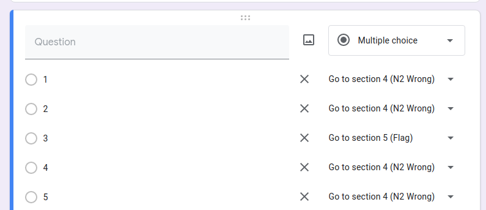
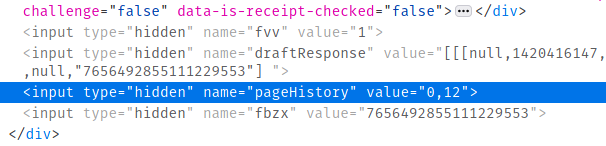
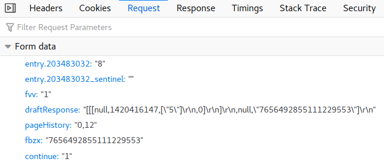
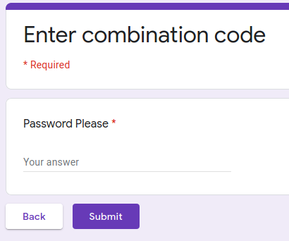
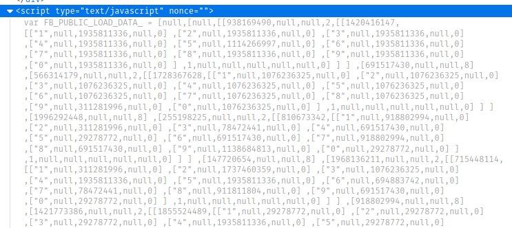
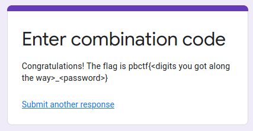

# GCombo

**Category**: Misc \
**Points**: 36

## Challenge

One day I spied out my friend accessing some google form to enter his secret
combination lock. Afterwards, I kept bothering him about it, and he finally
decided to give the link to me. Maybe you can figure out his combo for me and
get a tasty flag in return:

[link](https://docs.google.com/forms/d/e/1FAIpQLSe7sOTLHmGjmUY3iE6E7QLqeYAZDfQXsiJrz8r-ZcA_4cXNFQ/viewform)

By: theKidOfArcrania

## Solution

Made a test google form:



So the section numbers are significant. Where do we find them on the page?



What happens when we submit the form?



So `entry.203483032` holds the option we selected (8 in this case).

Let's try to explore all pages by sending requests like this.
Finally we get here:



Searching the HTML, we see this weird JSON thingy called
`FB_PUBLIC_LOAD_DATA_`. Turns out we could've used it to
[solve the challenge offline](https://flagbot.ch/posts/gcombo/), but oh well.



We find this:
```json
[766405565,"Password Please",null,0,[[1674649702,null,1,null,[[4,301,["s3cuR3_p1n_id_2_3v3ry0ne"]
```

Finally we get to the end:



Script output:
```
Doing page 0:
11 11 11 11 11 12 11 11 11 11
Doing page 11:
 4  4  4  4  4 11  4  4  4  4
Doing page 12:
 4  4  4  4  4  4  4  4  5  4
...
Doing page 17:
20 11 11 13 11  6 15  4  1 18
Doing page 13:
 7 20 20 20 20  9  9 19  1  7
Doing page 19:
Pin: [5, 8, 1, 2, 6, 9, 3, 3, 7, 0]
Flag: pbctf{5812693370_s3cuR3_p1n_id_2_3v3ry0ne}
```

What a cool challenge :smile:
