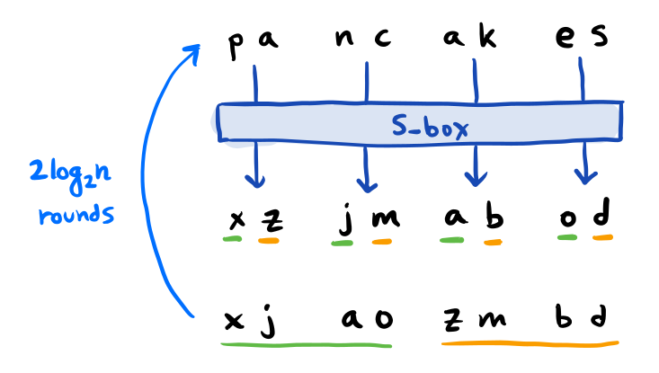
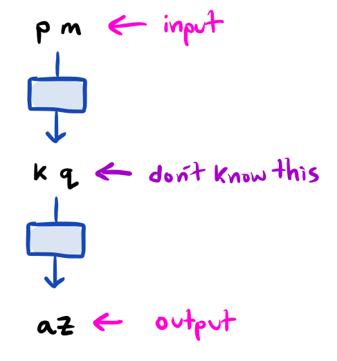
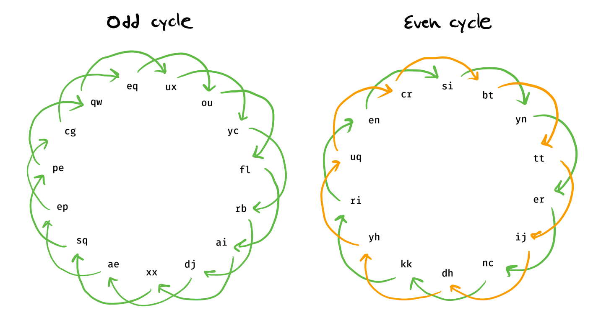
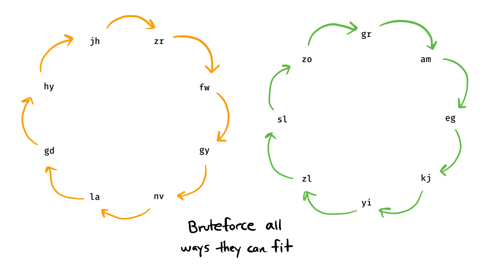
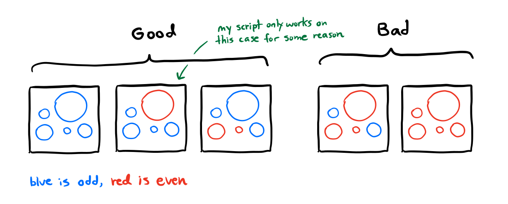

# Queensarah2

**Category**: Crypto \
**Points**: 200 \
**Solves**: 37 \
**Author**: UnblvR

## Challenge

The secret mainframe for a distributed hacker group has been discovered. We
have managed to exfiltrate some of the code that it runs, but we don't have a
physical copy of their access badges. Can you still get the flag?

Remote: `nc queensarah2.chal.perfect.blue 1`

Note: enter flag as `pbctf{lower_case_flag_text}`

By: UnblvR

## Solution

Looks like a home-rolled crypto algorithm. Basically it creates this dictionary
called `S_box` that maps all possible bigrams to another bigram from a shuffled
set.

```python
bigrams = [''.join(bigram) for bigram in product(ALPHABET, repeat=2)]
random.shuffle(bigrams)

S_box = {}
for i in range(len(ALPHABET)):
    for j in range(len(ALPHABET)):
        S_box[ALPHABET[i]+ALPHABET[j]] = bigrams[i*len(ALPHABET) + j]
```

Then the encryption step is like this:
```python
rounds = int(2 * ceil(log(len(message), 2))) # The most secure amount of rounds

for round in range(rounds):
    # Encrypt
    for i in range(0, len(message), 2):
        message[i:i+2] = S_box[''.join(message[i:i+2])]

    # Shuffle, but not in the final round
    if round < (rounds-1):
        message = \
          [message[i] for i in range(len(message)) if i%2 == 0] + \
          [message[i] for i in range(len(message)) if i%2 == 1]
```

So basically, it's like this:



The challenge server will encrypt anything for us, so what happens if we just
send it one bigram?



Ok, what happens if we take the encrypted output (`az` in the image above), and
send it to the server over and over again? Then eventually we'll get back to
where we started.

Turns out this is all we need to crack the encryption.
1. Make a set of all bigrams
2. Remove a bigram (store it in a var as the starting point) and send it to the
   server
3. Take the returned value and remove it from the set
4. Send that bigram to the server
5. Repeat until we get back to the start
6. Go to step 2 and repeat until we checked all 729 bigrams
7. If we're lucky, we can bruteforce all possible values of `S_box` and get 1
   correct decryption

The idea goes like this:
- `S_box` maps bigrams to another bigram (no two bigrams map to the same one)
- So there has to be at least one cycle
- Each cycle can either have even or odd length



Since sending a single bigram to the server will make it go through
`S_box` twice, we have to jump over 1 element in the cycle each time.
- If the cycle has odd length, we can still get to every element in the cycle
- If the cycle has even length, we can only get two halves of the cycle. What
  can we do?



Yeah, we can just bruteforce by rotating one of halves `n` times. But what if we
have more than one even cycle? Then we have to bruteforce all of them. If we're
lucky, the total number of iterations will be small.

Here are cases for the types of cycles in `S_box` we'll encounter. If we get a
bad `S_box` then we just close the connection and try again.



I wrote a semi-working script in [guess.py](guess.py), and during the CTF I just
let it run in the background. After around 20 minutes it got lucky:
```
atmxovxmydgu_colfvllcxdffczoachaatekepcveppptfirxzhbuinv__'
merftbsckhmidlylpn_smzjcguxbhgefekgwjypqqkswoeoyl_wwsofbpj'
brmecffzjpeewxbsispphlygeeetbl_fbwlhmdlqyowkdcejixrrjxkihw'
slide_attack_still_relevant_for_home_rolled_crypto_systems'
uwqnnykpzr_jwuieitlkfdsfahuywguoqnaomqhxpriruwnkuxbpbhhuoz'
a_egexqtpazpvkkodgibwvxi_c_sfcphrthinnjzeglecdggaa_d_vsfvj'
awqnqrmjmeikmgdjrc_ojviatxtwkmrjajuoi_buewwamyzlqvzuatpihe'

...


> slide_attack_still_relevant_for_home_rolled_crypto_systems
You got it. The flag is pbctf{slide_attack_still_relevant_for_home_rolled_crypto_systems}
```

Thanks perfect blue for the cool challenge!
