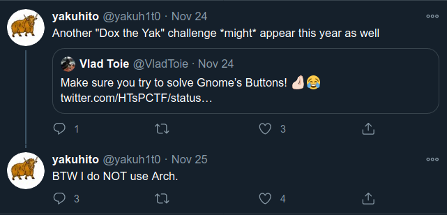
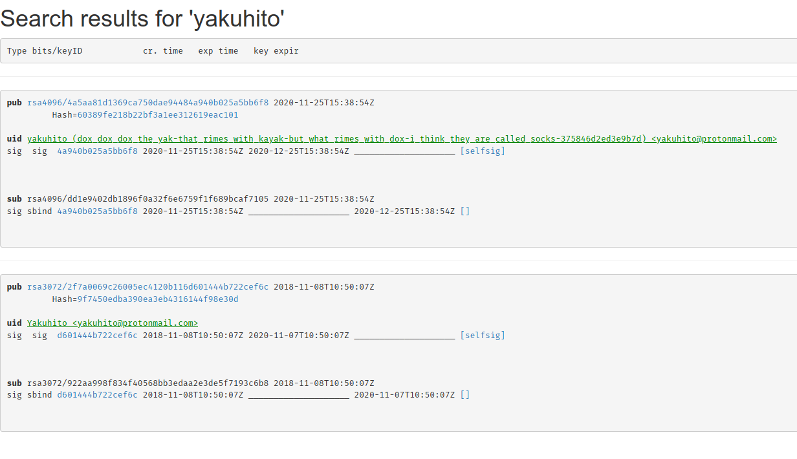

# Dox the Yak v4

**Category**: Misc \
**Points**: 491 \
**Author**: yakuhito

## Challenge

You have been warned that this could happen. \
Note: Wrap the feet-related thing with X-MAS{}

## Solution

Solved with tourpran.

1. Stalk him on Twitter



2. Look at his other challenges (e.g. The Cat):
```
$ strings logs.pcapng
Intel(R) Core(TM) i7-7700HQ CPU @ 2.80GHz (with SSE4.2)
Linux 4.15.0-123-generic
Dumpcap (Wireshark) 2.6.10 (Git v2.6.10 packaged as 2.6.10-1~ubuntu18.04.0)
...
```

3. He uses Ubuntu. Check all Ubuntu subdomains using Sublist3r
```
kubuntu.com
www.kubuntu.com
www.ubuntu.com
360.ubuntu.com
access.ubuntu.com
advantage.ubuntu.com
apps.ubuntu.com
public.apps.ubuntu.com
...
usn.ubuntu.com
usshop.ubuntu.com
www.usshop.ubuntu.com
videosearch.ubuntu.com
webapps.ubuntu.com
webstats.ubuntu.com
wiki.ubuntu.com
```

4. Find [hockeypuck.ubuntu.com](http://hockeypuck.ubuntu.com/)


5. Search for `yakuhito`



6. Profit
```
X-MAS{dox_dox_dox_the_yak-that_rimes_with_kayak-but_what_rimes_with_dox-i_think_they_are_called_socks-375846d2ed3e9b7d}
```
