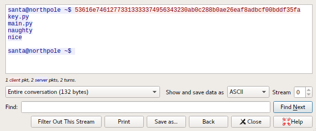
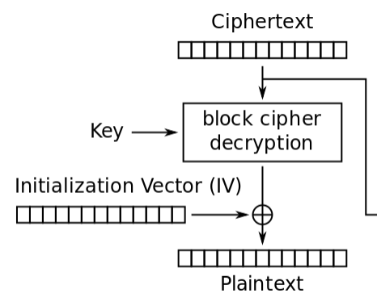

# Lost List

**Category**: Crypto \
**Points**: 396 \
**Author**: Heappie

## Challenge

Santa lost the key to his server where he keeps the lists of nice and naughty
kids and the server started to malfunction. Luckily looking through the logs we
found a capture file of his last connection to the server. He usually used this
server only to write the lists, but we need to recover the lists so try and log
into the server and read the lists. Santa counts on you, don't let him down!

Target: `nc challs.xmas.htsp.ro 1002`

## Solution

Open up `capture.pcagng` in Wireshark.
Right click, `Follow` -> `TCP Stream`



Looks like a shell, but the input is encrypted.
This is the input:
```
53616e74612773313333374956343230ab0c288b0ae26eaf8adbcf00bddf35fa
```

Decoding this hex string, we get:
```python
b'Santa's1337IV420\xab\x0c(\x8b\n\xe2n\xaf\x8a\xdb\xcf\x00\xbd\xdf5\xfa'
```

The string is 32 bytes in total.
The first 16 bytes are IV (`Santa's1337IV420`) and second 16 bytes are encrypted.
This is looks like AES-CBC.

Based on the output of the command from Wireshark, we can assume that the
plaintext was `ls`.

So to summarize:
- We know a plaintext and ciphertext pair
- We have control over the IV

This means we can forge an IV to make the server decrypt
`\xab\x0c(\x8b\n\xe2n\xaf\x8a\xdb\xcf\x00\xbd\xdf5\xfa` to an arbitrary
plaintext.

We can do this because the IV is XOR'd with the immediate state to obtain the
plaintext.



The last thing to remember is that plaintext blocks are padded with PKCS #7 in
AES-CBC.

Next I wrote a script (`solve.py`) to automatically encrypt input data and send
it to the server.
```
$ python3 solve.py
[+] Opening connection to challs.xmas.htsp.ro on port 1002: Done
santa@northpole ~$ ls
key.py
main.py
naughty
nice

santa@northpole ~$ cat nice
Command not found
santa@northpole ~$
```

They blacklisted the `cat` command, but we can just use `dd` instead.
```
santa@northpole ~$ dd if=nice
Alice
Bob
Galf
X-MAS{s33ms_1ik3_y0u_4r3_0n_7h3_1is7_700_h0_h0_h0}
```
