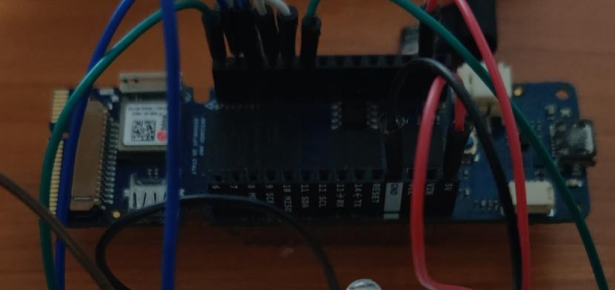
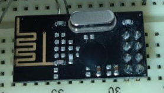
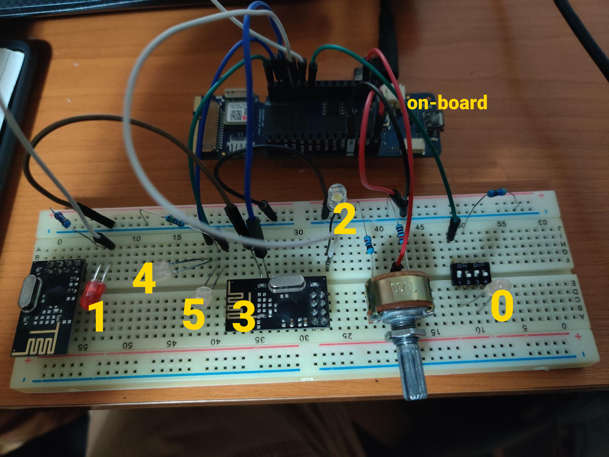
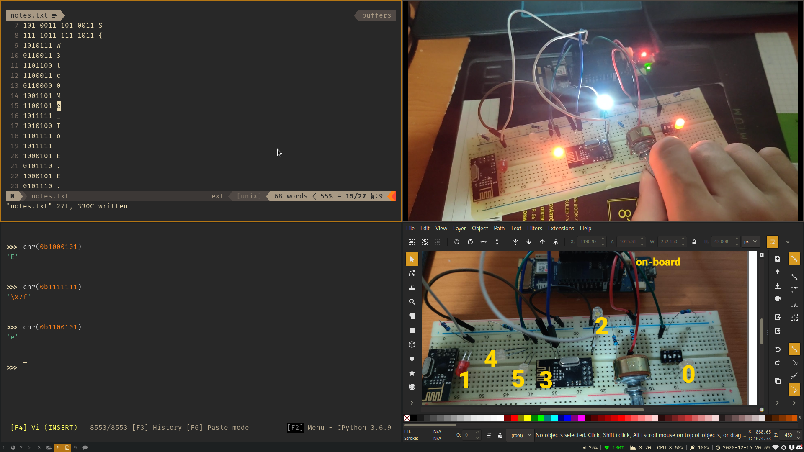

# Santa's Landing Pad

**Category**: Hardware \
**Points**: 354 \
**Author**: trupples

## Challenge

The elves and I have been working on some christmas lights to aid Santa in
landing back home in the fog. (You have NO IDEA how much we pay in repairs
every few years) Check them out! https://www.youtube.com/watch?v=162DpMTMfMI

File: `landing-pad.jpg`

## Solution

Looking at the video, we the lights showing different patterns at discrete time
intervals. We can assume that they are encoding some kind of message.

Let's start by identifying the hardware:



This is the [Arduino MKR Vidor 4000](https://store.arduino.cc/usa/mkr-vidor-4000).



My teammate bl3drag0nsec identified this as an
[ESP8266](https://www.sparkfun.com/products/17146).
But we can see from the circuit that it only receives one input from the
Arduino and doesn't seem to be doing anything special except flashing an LED.

Also, the second ESP8266 chip on the bottom left isn't even connected to anything.

Next let's identify all the LEDS based on which Arduino pin they are connected to:



In summary:
- There are 7 LEDs (including the on-board LED) controlled by the Arduino.
- The Arduino receives one input from a potentiometer.

We can assume that the Arduino is just mapping the input from the potentiometer
to a particular pattern of LEDs.

There are 7 LEDS, so we have 7 bits of information. Luckily, that's enough to
encode most of the ASCII range.

We we order the bits like so, we can see that the first state is:
```
<on-board> <5> <4> <3> <2> <1> <0>
         1  0   1   1   0   0   0
```

```python
>>> chr(0b1011000)
'X'
```

We know that flags start with `X-MAS{` so we are on the right track.
After going through the video and writing down each state, I got the flag:



```
X-MAS{W3lc0Me_To_E.E.}
```
