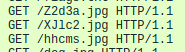

# santass

**Category**: Forensics \
**Points**: 247 \
**Author**: bobi

## Challenge

Please, someone check Santa's reindeers... They've been flying around all day.

File: `santass.pcapng`

## Solution

Opening it up in Wireshark, we saw a lot of HTTP packets and lot of 404 responses.
After a few hours, I eventually noticed this:



```bash
$ echo -n 'Z2d3aXJlc2hhcms=' | base64 -d
ggwireshark
```

Flag: `X-MAS{ggwireshark}`
