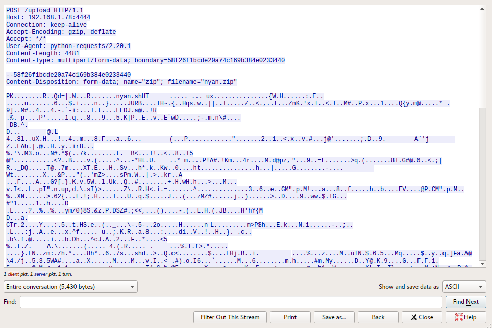

# The Cat

**Category**: Forensics \
**Points**: 359 \
**Author**: yakuhito

## Challenge

We know yakuhito's been playing in our internal network for over a year, but we
never managed to kick him out. Last week, he made the big screen at the
entrance play nyan cat.

File: `logs.pcapng`

## Solution

Opening it up in Wireshark, we see a lot of encrypted TLS traffic, but we do a
few interesting HTTP requests that are unencrypted.

Let's focus on the interesting parts by applying this filter:
```
ip.src == 192.168.1.194 || ip.dst == 192.168.1.194
```

Exporting the HTTP objects, we get some interesting files:
- `cert.pem`: RSA privey key and certificate
- `key.log`: Key log file (exactly what we need to decrypt TLS)

Right click -> `Protocol Preferences` -> `Open Transport Security Layer preferences...`
- `(Pre)-Master-Secret log filename`
  - Set path to key.log
- `TLS debug file`
  - Set it to a new file `dbg.log` so we can see debug logs from Wireshark
- `RSA keys list`
  - Somehow we should be using `cert.pem`, which contains the RSA private key
    and certificate.
  - Not really sure how to use this

these files into Wireshark. This decrypts a few interesting packets, namely packet number 4141:



We have a decrypted POST request where the user was trying to upload `nyan.zip`.

To carve it out, I wrote this:
```python
s = open('packets/4141.hex').read().strip()
x = bytes.fromhex(s)

zbi = x.index(b'PK')  # Zip magic bytes
zb = x[zbi:]

zbi = zb.index(b'\r\n--')  # End
zb = zb[:zbi]

open('nyan.zip', 'wb').write(zb)
```

Extracting `nyan.zip`, we get `nyan.sh`
```
$ bash nyan.sh
```


