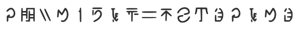
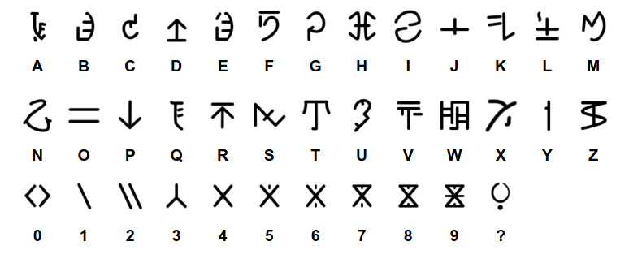

# Whispers of Ascalon

**Category**: Misc \
**Points**: 50 \
**Author**: Bobi

## Challenge

The one who bears the Magdaer shall curse his people forever after.

## Solution

Google "Ascalon" and "Magdaer" shows that they are from Guild Wars 2. Searching
on their [wiki](https://wiki.guildwars2.com/wiki/Main_Page) for languages.
Eventually we find this [page](https://wiki.guildwars2.com/wiki/New_Krytan):

Flag is `X-MAS{GW2MYFAVORITEGAME}`
