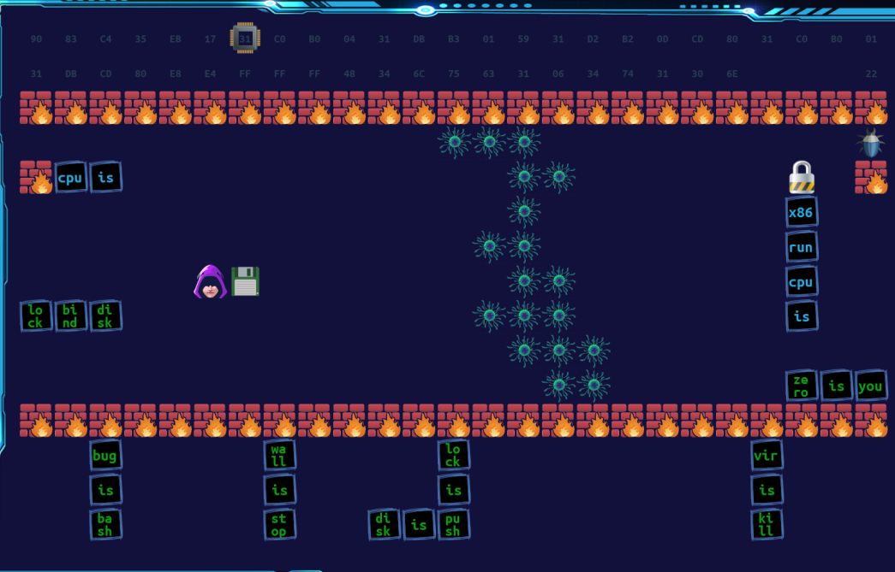

# DEF CON CTF 2021

## Intro

I joined StarBugs in-person at Las Vegas to compete in DEF CON CTF! As someone
who started playing CTF for less than a year ago, this was definitely an
eye-opening experience.

## Thursday

- `03:45 AM EST - 10:00 AM PST`

  - Woke up, packed my things, and drove to the airport.
  - Flights to Chicago and Las Vegas went smoothly—managed to get a decent
    amount of sleep.

  - Met with team at the Las Vegas airport and took a Lyft to the hotel.

- `10:00 AM - 11:59 PM`

  - Picked up vaccination wristbands, T-Shirts, challenge coins, and badges
    (mine is missing a key cap).

  

  - The team spent several hours trying to hijack the ethernet connection from
    the hotel TV. We tried spoofing the MAC address and doing some MITM, but
    in the end none of it worked so we just used Andrew's extra Windows laptop
    as a WiFi hotspot (SSID: `CelestialCentipedes`, password:
    `wefailedtohackthetv`)

  - We went to Johnny Rockets for lunch and Ramen-Ya for dinner. The ramen was
    particularly good.

  - Later that evening I helped elnardu debug a few things with fireball, our
    task runner for launching exploits against other teams. Meanwhile Qwaz was
    finishing up Siren, our CTF dashboard.

## Friday

- I woke up at 8 AM and went downstairs to the CTF floor at 9 AM.

- As we were setting up, we discovered that OOO accidentally leaked a bunch of
  challenges. Despite the leaked challenges, the competition started with only a
  slight delay. I focused on `zero-is-you`:

  

  - This was an extremely creative and fun challenge based on the game
    [Baba Is You](https://store.steampowered.com/app/736260/Baba_Is_You/).
  - The twist is that there's a CPU block, and each tile on the grid contains
    bytes that the CPU can execute.
  - The goal for each level is to pop a shell with `execve("/bin/sh")`.

  - I was able to solve challenges up to level 5 with Andrew and zeta, but we
    got stuck after that. Luckily qbeom and 챠늘 were able to solve four more
    levels with their insane shellcoding skills.

  - Here's a playthrough of qbeom's solution to Level 8, the last level our
    team was able to complete that day: https://youtu.be/fGSz1Yj5pRQ

- While I was working on `zero-is-you`, setuid0 got first blood on `ooopf` at
  around 12:30 PM! Hearing Zardus yell "FIRST BLOOD" into the microphone was
  always nice.

- That evening we got three pizzas from Giordano's. I've concluded that deep
  dish pizza tastes about the same as lasagna.

- At the end of the first day, we were in 3rd place! We also got a picture
  with Zardus (I'm the one on the left wearing a black mask).


- They also announced that the challenges for tomorrow would be `ooows-p92021`
  and `ooows-ogx`, which were part of a series of virtualization challenges.

## Saturday

- Woke up at 8:00 AM again to get ready for the CTF. Meme credit goes to Ammar:


- Our online players (particularly setuid0 and yonghwi) worked on `p92021`
  and `ogx` all night. Thanks to them, we were able to get first blood on both!

- I worked on a python script to automate their exploit on `p92021`:
  - It uploaded the exploit disk image and scraped the VM ID from the HTML
  - Next it started the VM and connected to the console socket to listen for
    the flag. This ended up being tricky to implement due to some timing
    issues, but we got the full automated exploit working at around 11 AM.

- Around the same time, a new King of the Hill challenge was released: `www`
  (The Wild Wild West).

  - Essentially, there were a bunch of vulnerable services scattered throughout
    the game network. Teams had to pwn these services and use the flags to
    "vandalize" other teams walls.

  - It was an open-ended and interesting challenge, but unfortunately we didn't
    score many points on this one. By the time we knew what was going on, other
    teams had already pwned many services, making it much harder for us to
    exploit.

  - But in the last hour, Andrew found a bug in the challenge infrastructure:
    you could submit the same flag over and over again to get new graffiti on
    each tick. We leveraged this as much as possible and in the end were able to
    score a score a few points on the problem 😅

  

- At 8 PM, the services were shutdown and OOO released three challenges that
  would be used tomorrow: `ooows-broadcooom`, `ooows-hyper-o`, and
  `shooow-your-shell`

- After grabbing dinner at Subway, I started working on the KoH problem:
  `shooow-your-shell`.

  - This is a shellcoding challenge: the goal is to read a file named `secret`
    and print it out. Any team can submit shellcode whenever they want, and the
    current best shellcode is called a "king." To become the new king, your
    shellcode cannot use any banned bytes (more bytes are banned as more
    solutions accumulate). Then your shellcode needs to pass either of these
    checks:

```python
# if the shellcode avoids bytes used by the previous winner, accept it.
# The avoided bytes will be added to the block list for future submissions.
if set(previous_shellcode) - set(shellcode):
    print("Congrats! You have evolved past the bytes used by your opponents.")
    return True

# if the shellcode is shorter, accept it
if len(shellcode) < len(previous_shellcode):
    print("Congrats! You have progressed on your journey to elegance.")
    return True
```

  - An important detail was that you could see other teams' solutions, allowing
    you to steal them for use in later rounds.

  - The server accepts x86_64, aarch64, and riscv64 shellcode. I started by
    writing basic `openat, read, write` shellcode in C:

```c
#include "syscall_x86_64.h"

void _start() {
    char name[7] = "secret";  // Put it on the stack
    int fd = __syscall3(__NR_openat, -100, name, 0);

    char buf[32];
    __syscall3(__NR_read, fd, buf, 32);
    __syscall3(__NR_write, 1, buf, 32);
}
```

  - I was hoping to be able to compile it for aarch64 and riscv64 as well, but
    due to the way the stack works for those architectures, I ended up having to
    write it by hand anyway.

  - After writing basic shellcode for the three architectures, it was 2:30 AM
    so I took a nap until 6 AM so that I'd have time to write a client to
    automatically scrape and submit shellcodes before the CTF started.

## Sunday

- When I woke up, I saw that yonghwi had come up with this 3 byte RISC-V shellcode:

```asm
c.li x0, 2
ecall
```

- What the heck???
- So it turns out that the shellcode runner leaves `stderr` open. I assumed that
  this was just for debugging purposes, but you can actually abuse this like
  so:
  - Read `openat, read, write` payload from `stderr`
  - Execute it

- Ammar went through and checked the register state for each architecture:
  RISC-V had the optimal register state, allowing us to create this incredibly
  short shellcode.

- Around 30 minutes before the services went live, I was finishing up the client
  for interacting with the service. Meanwhile Qwaz was working on scripts to
  generate variations of the `stderr` stager shellcodes.

- After overcoming some initial difficulties, we finally managed to become king
  of the hill!

```
# Current hill:
GLORIOUS VICTORY
... under that, code from team StarBugs: 698973
... under that, code from team 侍: 1305c0f937333a001b03932b1313c3001303b3311313d30013033357233061009305010013060000930600009308800373000000930505001305100013060000930600029308700473000000
... under that, code from team NorseCode: e0031faa41010010e2031faa080780d2e16602d4e10300aa200080d2020080d2030480d2e80880d2e16602d42f736563726574

# Renowned ancestors
... Zardus made the battlefield

# Blocked bytes: 00 01 02 03 04 05 06 07 08 10 13 1b 1f 20 23 2b 2f 30 31 33 37 3a 41 57 61 63 65 66 70 72 74 80 90 93 aa b3 c0 c3 d2 d3 d4 e0 e1 e2 e8 f9
# Allowed bytes: 09 0a 0b 0c 0d 0e 0f 11 12 14 15 16 17 18 19 1a 1c 1d 1e 21 22 24 25 26 27 28 29 2a 2c 2d 2e 32 34 35 36 38 39 3b 3c 3d 3e 3f 40 42 43 44 45 46 47 48 49 4a 4b 4c 4d 4e 4f 50 51 52 53 54 55 56 58 59 5a 5b 5c 5d 5e 5f 60 62 64 67 68 69 6a 6b 6c 6d 6e 6f 71 73 75 76 77 78 79 7a 7b 7c 7d 7e 7f 81 82 83 84 85 86 87 88 89 8a 8b 8c 8d 8e 8f 91 92 94 95 96 97 98 99 9a 9b 9c 9d 9e 9f a0 a1 a2 a3 a4 a5 a6 a7 a8 a9 ab ac ad ae af b0 b1 b2 b4 b5 b6 b7 b8 b9 ba bb bc bd be bf c1 c2 c4 c5 c6 c7 c8 c9 ca cb cc cd ce cf d0 d1 d5 d6 d7 d8 d9 da db dc dd de df e3 e4 e5 e6 e7 e9 ea eb ec ed ee ef f0 f1 f2 f3 f4 f5 f6 f7 f8 fa fb fc fd fe ff
You already own this hill!
```

- Lucky for us, we were the only team to utilize the `stderr` trick (for now).


- However other teams were quick to catch up and within 1 hour we were
  struggling to attain the hill. Thankfully yonghwi came up with yet another
  shellcode with `2^16` variations—this time using aarch64: `lsr w0, w2, #11;
  svc #0xfeff`. Qwaz also managed to come up with even more RISC-V payloads that
  allowed us to attain the hill.

- Katzebin, PPP, and Tea Delivers had extremely strong performance on this
  challenge, and the competition was especially intense towards the end. At one
  point, Katzebin submitted the exact same payload we were planning to submit,
  beating us by a few seconds:

```
# Current score: 1628453467
# Current hill:
GLORIOUS VICTORY
... under that, code from team Katzebin at 1628453497: 7d3573
... under that, code from team Plaid Parliament of Pwning at 1628452943: 13c5060273
... under that, code from team StarBugs at 1628452215: 599973
```

- In the final 45 minutes, the amount of blocked bytes become so ridiculous that
  only 3 bytes were allowed, making it virtually impossible to take to hill. At
  this point we just let our scripts run, though they failed to find any
  solutions. Here's a picture of us near the end of this challenge:


- Surprisingly, one of the last payloads we saw was `7300` by PPP. We didn't
  even consider that a 2 byte payload was possible, but they did it with a
  single syscall 👏

- I almost forgot to mention it, but we also got first blood on both stages
  of `ooows-hyper-o`, thanks to setuid0! In total, we managed to get first
  blood on 4 challenges.

- And with that, the CTF was over!


- During closing ceremony at around 4 PM, the final scores were
  announced—we got 4th place! Competition was particularly tight with Tea
  Deliverers, so congratulations to them for their awesome work.


- That night ooorganizers hosted the after-party in their suite at 8 PM. I had
  great time and met a bunch of people from other teams, as well as from OOO.


- I was a little sad to hear that this was the last year OOO would be hosting
  DEF CON CTF, but I can definitely say that they went out with a bang—this
  year's CTF was absolutely amazing.
