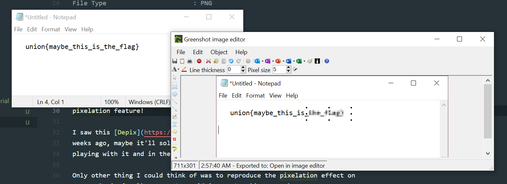
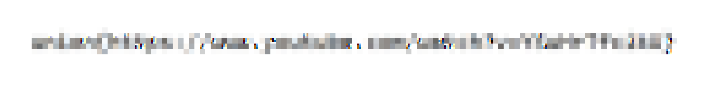
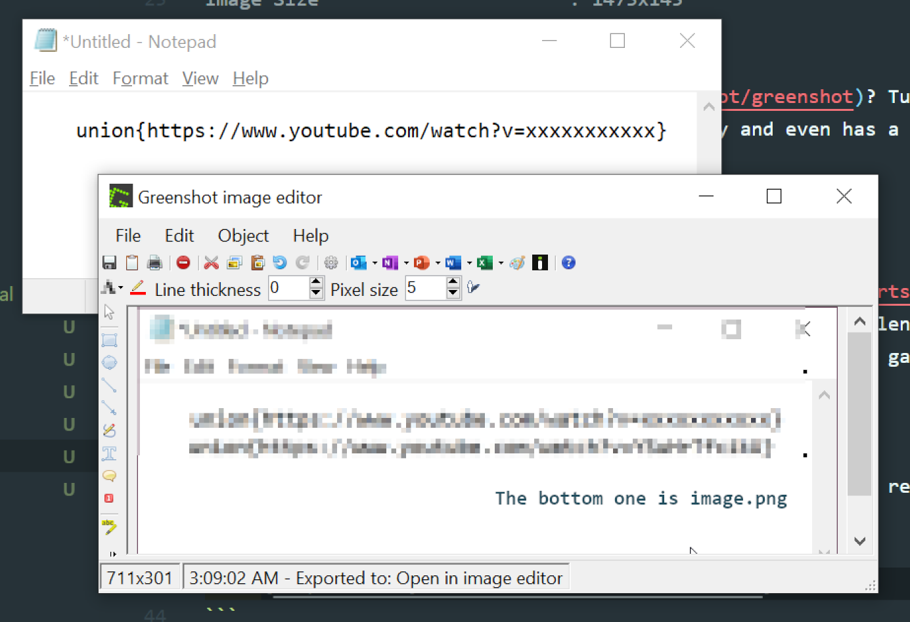
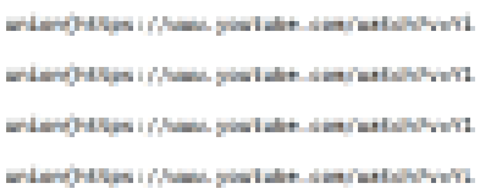
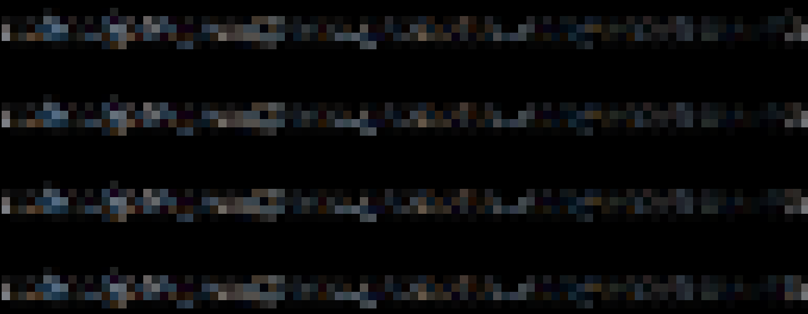
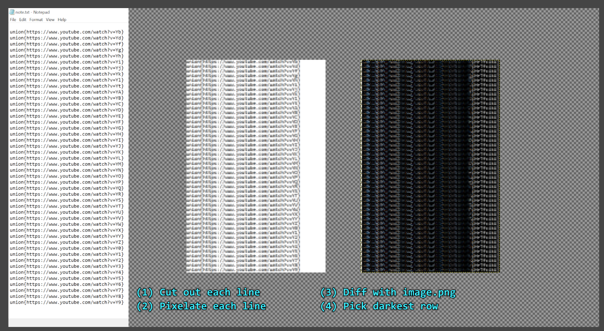
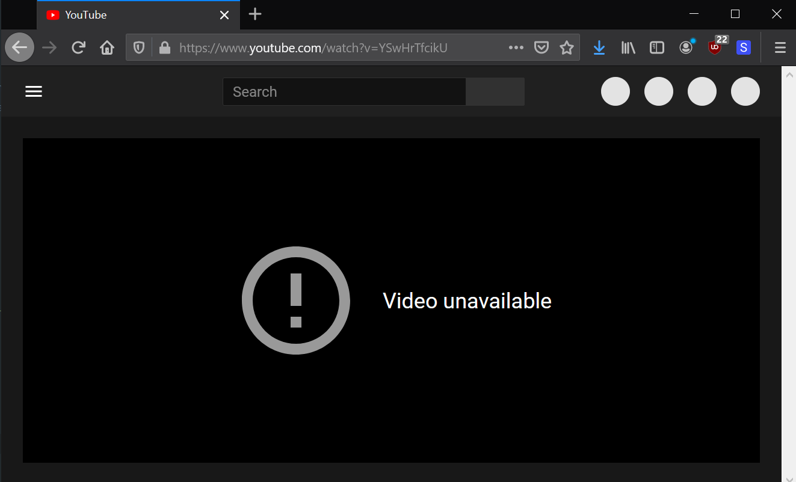
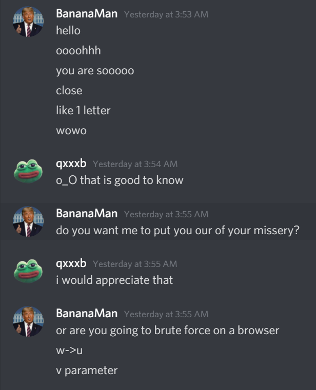
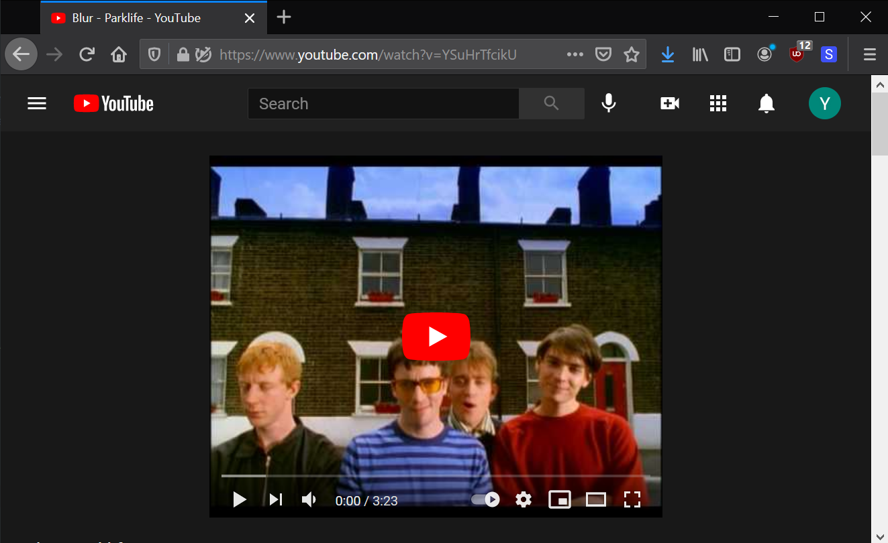

# Sensitive Material

**Category**: Misc \
**Points**: 995 (3 solves) \
**Author**: BananaMan

## Challenge

We have received this redacted image from a very sensitive report. Surely
using blur is an effective redaction method?


## Solution

Check metadata:
```
File Name                       : image.png
File Size                       : 18 kB
File Type                       : PNG
Image Width                     : 1473
Image Height                    : 145
Color Type                      : RGB
Software                        : Greenshot
Image Size                      : 1473x145
```

Wtf is [Greenshot](https://github.com/greenshot/greenshot)? Turns out it's a
screenshot tool for Windows. It's pretty fancy and even has a built-in
pixelation feature!



Then I remembered I saw this [Depix](https://github.com/beurtschipper/Depix)
tool on Twitter a few weeks ago. Maybe it'll solve the challenge for me!
WRONG I wasted hours playing with it and in the end it just gave me this:



Not helpful, but looking at the image for the 9999th time I realized if I
squinted my eyes it looked like:
```
union{https://www.youtube.com/watch?v=xxxxxxxxxxx}
```

To check if that was true, I tried to reproduce the pixelation effect with my
own text and see if it matched `image.png`. I actually got very lucky here
because I almost immediately got something very similar:



I had 150% display scale on a 2560x1440 screen with Notepad using Consolas 11
pt (the default). Now that I could reproduce the pixelation my plan was to
try different characters one by one and pick the best visual match.

At first I tried doing this by hand:
1. Open Notepad
2. Type in `union{https://www.youtube.com/watch?v=Yxxxxxxxxxx}`
2. Take a screenshot
3. Pixelate it
4. Compare with `image.png`

The first character was obviously `Y`, but the second was harder to tell: it
kind of looked like one of these: `L 1 l f t`, so I tried each one and put
them into GIMP:



WTF?? They look so similar I can barely tell them apart. Clearly I need a way
to precisely diff them. Actually, while we have GIMP open let's do a
pixel-wise subtraction between `image.png` and our candidates:



The darker it is, the closer it matches. That makes the first row `L` the
closest match here. But tbh when I eyeball it, it doesn't seem that much
worse than the other ones. I probably need to check all the other printable
ASCII chars to make sure. Time to automate stuff.



And now which character best matches the 2nd character? SURPRISE IT'S
ACTUALLY `S` LOL. Here are the characters from ranked from best to worst (and
WTF `L` is actually below average, looks like I dodged a bullet):
```
S 5 3 t E 4 6 8 R 9 F B A k i Z X I 1 0 G K f 7 T 2 J l L b h N C Y d O P j W D M H U V Q g
```

Repeat this for all the characters and here's what I got (messy script in `solve.py`):
```
Y |
S | 5 3 t E 4 6 8 R 9 F B A k i Z X I 1 0 G K f 7 T 2 J l L b h N C Y d O P j W D M H U V Q g
w | u x o v s a 4 c q d i m n z k p b y 6 e r 1 5 h l 8 3 t - 0 2 9 f g 7 j _
H | M W N h U P b 0 k F d K G R O 6 9 E B 8 D S V L X A 5 Y C Z Q 7 4 2 3 t f i T 1 I J l j
r | v x n f c s - F e y a u k h o z V t 6 w m b 3 i 9 E L X d 7 H T 8 U J N 1 l 2 I C Z M D _
T | 7 J I Z Y l 3 1 2 9 t S 5 f E i G O K X R j V 0 D F P C U 6 k 8 d B A 4 N h b H M L W Q g
f | F t 5 E 3 7 T 9 Y S 8 6 4 R J P B k i 2 I K 0 Z A X C 1 G l L V d j b O h N D W M U g H Q
c | v x s w u r o n k L e y z t V a i h q U E d m - A b 6 p 5 C H 4 F f I l 1 3 9 D 8 0 2 J 7 g j
i | tS 5 1 4 2 l 3 I J 6 d Z E 9 8 A f 0 7 G K B k T X j C Y R V L b F O N W g P D h U M H Q
k | t i h b K 6 L X S E Y 5 V U 9 1 f l H C A N d F B 0 3 I W 8 Z 4 R G D P T O 2 J M 7 g j Q
U | G K E t k V b 6 S A 5 8 d C X N W L B O 0 Z 2 h D i 9 Y 3 1 l R 4 J F H I Q P f 7 T M g j
```

So that means the flag must be this RIGHT??
```
union{https://www.youtube.com/watch?v=YSwHrTfcikU}
```

WRONG \*INTERNAL SCREAMING\*.



Ok very sad. I was ready to brute youtube URLs but why not ask the admin first:



THANK FUCK finally got first blood after hours of work.



Props to BananaMan and Union CTF for this rollercoaster of a challenge!
